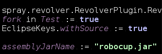
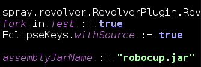

# Linux color inversion

This repository shows how to do "smart" color inversion on Linux.

The general idea is to transform black-on-white texts to white-on-black, which may reduce the stress on your eyes, especially in dark environments.

There are many ways to do "color inversion" though:

Name | First image  (editor) | Second image  (color chooser)
---- | ------------- | ------
Original Image|  | 
RGB negation |  | 
Matrix (halfs) |  | 
Matrix (thirds) |  | 
RGB+HUE |  | 

## RGB negation
Worst transformation, but also the simplest.

Black becomes white and vice versa. Color `(r,g,b)` transforms to `(1-r, 1-g, 1-b)`. It can be applied to your system by installing `xcalib`, and running `xcalib -i -a`. To restore, type the same command again.

## Color matrix multiplication
This is a relatively good approach, although it does lose some quality (see below).

The idea is to make each (r,g,b) component to be a linear function from original r,g,b values.

The "Matrix (halfs)" picture was generated by the formula: `(new_red = 1 - (1/2)*green - (1/2)*blue)`

The "Matrix (thirds)" picture was generated by the formula: `(new_red = 1 + (1/3)*red - (2/3)*green - (2/3)*blue)`

See below on how to enable this color transformation on Linux (compton).

References: these color transformations are also implemented in the Windows-only application ["NegativeScreen"](https://github.com/mlaily/NegativeScreen). I studied those repo matrices while doing this comparison.

## RGB negation combined with HUE rotation

This is the subjective "best" approach I found so far. It does not lose color richness (it's a bijection from full RGB color space to itself), resulting HUE value is always the same as original.

See below on how to enable this color transformation on Linux (compton).

## Making it work with "compton"

In order to bring these niceties to your system do:

* Install `compton` compositor
* Clone this repo (or download the *.glsl files)
* Go into the directory containing the *.glsl files
* Launch the compositor with: `compton --backend glx --glx-fshader-win "$(cat color_smart.glsl)" --invert-color-include id!=0`

If you want to try out other transformations (like matrices, or maybe some of your own glsl), just insert a different file into the "script" above.

**Warning:** This will replace your current (xfce/gnome/kde/i3/whatever) compositor. Non-permanently, so if you're not satisfied, kill the compositor and/or start your old one back. Alternatively, log out and log in back.

## Alternatives

To the best of my knowledge, these approaches do NOT work:

* XRenderer
* gamma ramps modifications (because they are color-independent)
* xcalib modifications, because it uses gamma ramps
* and actually everything non-OpenGL-based.

Reported to be working:

* ubuntu `compiz` compositor along with a manually compiled "Color Filter" plugin. [https://ubuntuforums.org/showthread.php?t=1419702](https://ubuntuforums.org/showthread.php?t=1419702)

## Credits

* The `compiz` plugin and the ubuntu forum for showing that the task is possible, and showing it should be OpenGL-based
* Compton developers
* Kurnevsky Evgeny for suggesting and explaining on how to use compton for such a task.
