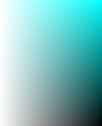
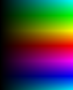
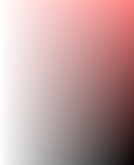
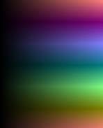
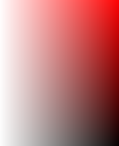
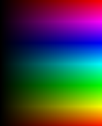
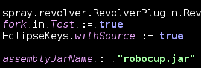

# Linux color inversion

This repository shows how to do "smart" color inversion on Linux.

The general idea is to transform black-on-white texts to white-on-black, which may reduce the stress on your eyes, especially in dark environments.

There are many ways to do "color inversion" though:

Name | First image  (editor) | Second image  (color chooser) | Third image  (gimp chooser)
---- | ---- | ---- | ----
Original Image|  |  | 
RGB  negation |  |  | 
Matrix  (halfs) |  |  | 
Matrix  (thirds) |  |  | 
RGB shift |  |  | 
RGB Shift (non-linear) |  |  | 

## RGB negation
The simplest, but probably also the worst.

Black becomes white and vice versa. Color `(r,g,b)` transforms to `(1-r, 1-g, 1-b)`. It can be applied to your system by installing `xcalib`, and running `xcalib -i -a`. To restore, type the same command again.

## Color matrix multiplication
This is a relatively good approach, although it does lose some quality (see below).

The idea is to make each (r,g,b) component to be a linear function from original r,g,b values.

The "Matrix (halfs)" picture was generated by the formula: `(new_red = 1 - (1/2)*green - (1/2)*blue)`

The "Matrix (thirds)" picture was generated by the formula: `(new_red = 1 + (1/3)*red - (2/3)*green - (2/3)*blue)`

See below on how to enable this color transformation on Linux (compton).

References: these color transformations are also implemented in the Windows application [NegativeScreen](https://github.com/mlaily/NegativeScreen). I studied those repo matrices while doing this comparison.

## RGB shift

This approach preserves the "color" (hue) and maintains color richness (the transformation is a bijection from RGB color space to itself).

Technically, this transformation is the same as doing 180-degree HUE rotation combined with RGB negation.

See below on how to enable this color transformation on Linux (compton). You can test it on images with GIMP:
1. Menu > Colors > HueSaturation > Hue > 180 > OK.
2. Menu > Colors > Invert

## RGB shift (light bias)
The same as RGB shift, but with a bias to "colorfullness"
for dark colors (also making them less dark).

It tends to preserve "colorfullness" a bit better than "RGB shift".
It loses the RGB space a bit though because of taking fractions.
The "color gamut" is preserved.

This seems to be a controversal color inversion technique,
but it actually gives pretty good results for e.g. code diffs (TODO: add screenshots). I'll write a full description later.

## Making it work with "compton"

In order to bring these niceties to your system do:

* Install `compton` compositor
* Clone this repo (or download the *.glsl files)
* Go into the directory containing the *.glsl files
* Launch the compositor with: `compton --backend glx --glx-fshader-win "$(cat shift_whiteish.glsl)" --invert-color-include id!=0`
* If you use subpixel order for your fonts, consider inverting them simultaneously, too (RGB should become BGR and vice-versa).

If you want to try out other transformations (like matrices, or maybe some of your own glsl), just insert a different file into the "script" above.

**Warning:** This will replace your current (xfce/gnome/kde/i3/whatever) compositor. Non-permanently, so if you're not satisfied, kill the compositor and/or start your old one back. Alternatively, log out and log in back.

## Alternatives, future work

To the best of my knowledge, these approaches do NOT work:

* XRenderer
* gamma ramps modifications (because they are color-independent)
* xcalib modifications, because it uses gamma ramps
* and actually everything non-OpenGL-based.

Some discussion on Wayland support can be found [here](https://github.com/vn971/linux-color-inversion/issues/2).

MacOS users had an option for RGB shift, but seemingly lost it in 2014: https://github.com/lswank/Tranquility/issues/9

Reported to be working:

* ubuntu `compiz` compositor along with a manually compiled "Color Filter" plugin. [https://ubuntuforums.org/showthread.php?t=1419702](https://ubuntuforums.org/showthread.php?t=1419702)

A future work might be to find some "colorfullness"-preserving algorithm, in addition to preserving hue and doing some form of brightness inversion. If interested, see wikipedia for "colorfullness" and prepare yourself to experiment with glsl code.

## Credits

* The `compiz` plugin and the ubuntu forum for showing that the task is possible, and showing it should be OpenGL-based
* Compton developers
* NegativeScreen(Windows) developers for providing analysis, matrix examples
* Kurnevsky Evgeny for suggesting and explaining on how to use compton for such a task.
